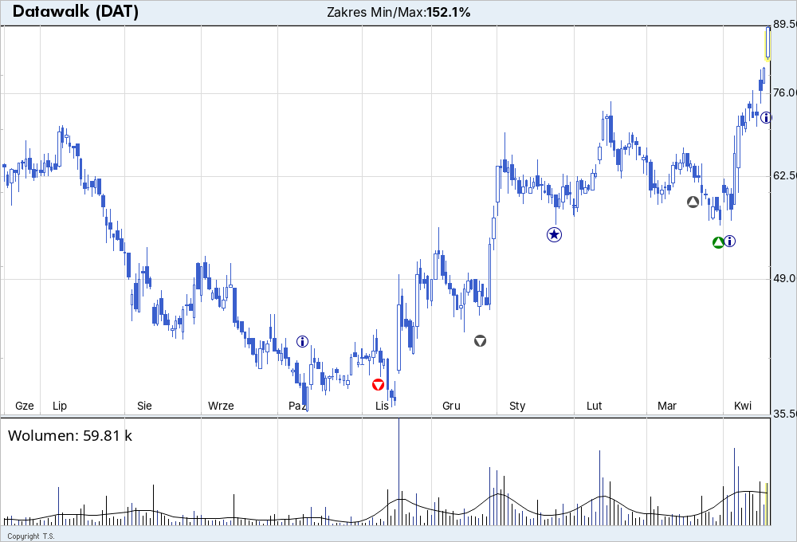

# Complex Stock Chart with Event Markers – Gnuplot

This Gnuplot script (`stock_chart_complex.plt`) demonstrates advanced visualization techniques for financial data, showcasing how Gnuplot can function as both a plotting tool and a logic engine. The script processes Warsaw Stock Exchange data for Datawalk (DAT) with example events.

<br/>



Warsaw Stock Exchange (GPW) Stock Analysis

The chart displays real trading data from the Warsaw Stock Exchange (GPW), covering June 2024 to April 2025. This is a **demonstration script** that requires  prepared data  columns.

##  Event Marking System

The script uses column 8 in the data file (`eod.txt`) to mark important events with different numeric codes:

| Code | Event Type | Color | Description |
|------|------------|-------|-------------|
| `1` | Sell Recommendation | Red | Strong sell signal |
| `2` | Reduce Recommendation | Gray | Reduce position |
| `4` | Buy Recommendation | Gray | Moderate buy signal |
| `5` | Strong Buy | Green | Strong buy recommendation |
| `8` | Company Report | Blue | Quarterly/annual reports |
| `9` | Dividend | Blue | Dividend payments |

### Smart Positioning Logic

The script intelligently positions event markers to avoid overlap with price action:

```gnuplot
# Example: Buy recommendation positioning
'' u 0:($8 == 5 ? (($5 > (my_median)) ? $4 * (1 - step) : $3 * (1 + step)) : 1/0):(recommendation_buy_symbol)
```

- **Above median price**: Markers appear below the low price
- **Below median price**: Markers appear above the high price

## Ternary Operator for conditional plotting

The script extensively uses ternary operators for conditional data processing:

### Basic Column Filtering
```gnuplot
# Show data only when condition is met, otherwise return 1/0 (undefined)
'' u 0:($8 == 1 ? ($4 * (1 - step)) : 1/0):(recommendation_sell_symbol)
```

### Multi-Level Conditional Logic
```gnuplot
# Nested ternary operators for complex conditions
price_change_color(change_percent) = (change_percent > 3 ? '#008B45' : ( \
                change_percent > 2 ? '#007700' : ( \
                    change_percent >= 0 ? '#007700' : '#EE0000')))
```

### Dynamic Positioning Based on Price Data
```gnuplot
# Position markers above or below price based on close vs median
'' u 0:($8 == 4 ? (($5 > (my_median)) ? $4 * (1 - step) : $3 * (1 + step)) : 1/0)
```

### Candlestick Color Logic
```gnuplot
# Different plots for up/down candles based on open vs close
'' u 0:($2 <= $5 ? $2 : 1/0):4:3:5 w candlesticks lc rgb up_color
'' u 0:($2 > $5 ? $2 : 1/0):4:3:5 w candlesticks lc rgb down_color
```

### Volume Bar Conditional Coloring
```gnuplot
# Volume bars colored based on price direction
'' u 0:($2 > $5 ? $6 : 1/0) w impulses lc rgb down_volume_color
'' u 0:($2 < $5 ? $6 : 1/0) w impulses lc rgb up_volume_color
```

## Advanced Gnuplot Techniques Demonstrated

### 1. Conditional Rendering with Inline Expressions
Selective rendering using `1/0` and ternary operators to mask or show data points dynamically.

### 2. Serial Evaluation for State Tracking
Using variables to carry state across data rows:
```gnuplot
grab_values(y) = (back_2 = back_1, back_1 = y)
```

### 3. Custom Functions for Modular Logic
Logic encapsulated in Gnuplot functions for color control and condition simplification:
```gnuplot
recommend_color(code) = (code eq "BUY" ? rgb("green") : code eq "SELL" ? rgb("red") : rgb("gray"))
```

### 4. Multi-Layer Plot Composition
Combining lines, filled boxes, arrows, and point markers with independent visibility rules.

## Summary
This script demonstrates how Gnuplot can act as both a plotter and a lightweight logic engine, using ternary operators extensively for conditional data processing. It's especially useful when you want full control over what gets shown and why, all from inside a self-contained `.plt` file — no external scripting required.
